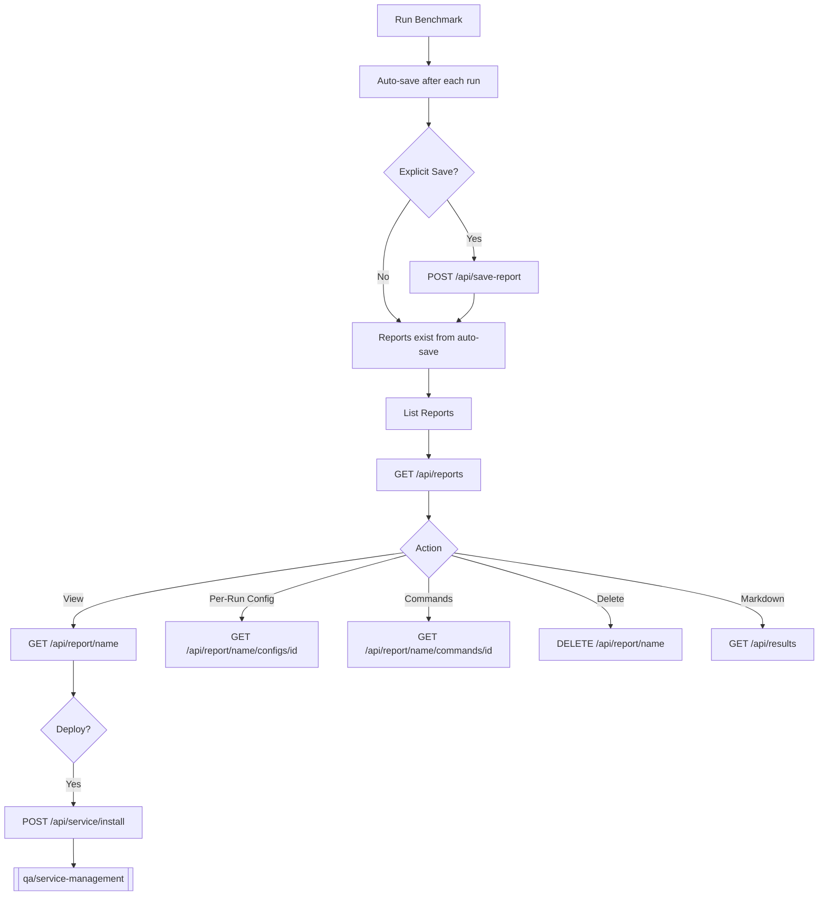

# Report Workflow

Save, view, and manage benchmark reports.

## What Is a Report?

A report captures a complete benchmark session:

- **Markdown results** — formatted tables from `results.md`
- **Live results** — per-test-run metrics (tokens/sec, memory, timing)
- **Configs per run** — exact parameters for each test run combination
- **Full config** — the base configuration at save time

Reports are stored in the database (SQLite/MySQL) with JSON fallback to `~/.betty/reports/`.

## Auto-Save

Reports are **auto-saved after each test run completes**. The name is generated as `YYYY-MM-DD-model-basename`. You can also explicitly save at any time.

## Save a Report

```bash
# Save with custom name
curl -X POST http://localhost:3456/api/save-report \
  -H "Authorization: Bearer $TOKEN" \
  -H "Content-Type: application/json" \
  -d '{"name":"2024-06-20-llama-3-8b-final"}'

# Save with auto-generated name
curl -X POST http://localhost:3456/api/save-report \
  -H "Authorization: Bearer $TOKEN" \
  -H "Content-Type: application/json" \
  -d '{}'

# Response: {"success":true,"message":"Report saved as 2024-06-20-llama-3-8b-final"}
```

## List Reports

```bash
curl -H "Authorization: Bearer $TOKEN" \
  http://localhost:3456/api/reports

# Response:
# {
#   "success": true,
#   "data": [
#     {"name": "2024-06-20-llama-3-8b-final", "filename": "2024-06-20-llama-3-8b-final.json", "created": "2024-...", "modified": "2024-..."},
#     {"name": "2024-06-19-mixtral-test", "filename": "2024-06-19-mixtral-test.json", "created": "2024-...", "modified": "2024-..."}
#   ]
# }
```

## View a Report

```bash
curl -H "Authorization: Bearer $TOKEN" \
  http://localhost:3456/api/report/2024-06-20-llama-3-8b-final

# Response:
# {
#   "success": true,
#   "data": {
#     "name": "2024-06-20-llama-3-8b-final",
#     "savedAt": "2024-06-20T12:00:00.000Z",
#     "mdContent": "# llama.cpp Benchmark Results\n\n...",
#     "liveResults": [
#       {
#         "testRunId": 1,
#         "avgGenTokensPerSec": 45.2,
#         "avgPromptTokensPerSec": 120.5,
#         "totalGenTokens": 3200,
#         "totalPromptTokens": 600,
#         "totalTimeMs": 48000,
#         "avgMemUsed": 6.2,
#         "avgMemTotal": 24.0
#       },
#       ...
#     ],
#     "configsPerRun": [
#       {
#         "testRunId": 1,
#         "testParameters": {
#           "contextLength": 32768,
#           "batchSize": 128,
#           "uBatchSize": 64,
#           "cacheRam": 4096,
#           "gpuLayerOffload": 999
#         },
#         "modelParameters": {
#           "temperature": 0.6,
#           "topP": 0.95,
#           "minP": 0,
#           "topK": 20
#         },
#         "serverParameters": {
#           "model": "/home/user/.betty/models/llama-3-8b.gguf",
#           "host": "localhost",
#           "port": 11434,
#           "flashAttn": 1,
#           "reasoning": 1,
#           "ropeScaling": "yarn",
#           "parallel": 1,
#           "contBatching": true,
#           "gpuLayers": 999
#         },
#         "splitParameters": {
#           "layerSplit": null,
#           "tensorSplit": null,
#           "primaryGpu": null,
#           "gpuSelection": [0]
#         },
#         "environment": {
#           "GGML_CUDA_ENABLE_UNIFIED_MEMORY": "1",
#           "CUDA_SCALE_LAUNCH_QUEUES": "4x",
#           "LLAMA_CACHE": "/home/user/betty/llama_cache",
#           "GGML_CUDA_P2P": "on",
#           "LLAMA_ARG_FIT": true
#         },
#         "cmakeFlags": {
#           "GGML_CUDA": "1",
#           "GGML_CUDA_GRAPHS": "1",
#           "GGML_CUDA_FA": "1",
#           "GGML_CUDA_FP16": "true",
#           "GGML_LTO": "1",
#           "GGML_CCACHE": "1"
#         }
#       },
#       ...
#     ],
#     "configs": { ... base configuration ... }
#   }
# }
```

## Get Per-Run Config

View the exact parameters for a specific test run:

```bash
curl -H "Authorization: Bearer $TOKEN" \
  http://localhost:3456/api/report/2024-06-20-llama-3-8b-final/configs/3

# Response:
# {
#   "success": true,
#   "data": {
#     "testRunId": 3,
#     "testParameters": {
#       "contextLength": 131072,
#       "batchSize": 384,
#       "uBatchSize": 192,
#       "cacheRam": 6144,
#       "gpuLayerOffload": 999
#     },
#     "modelParameters": {...},
#     "serverParameters": {...},
#     "splitParameters": {...},
#     "environment": {...},
#     "cmakeFlags": {...}
#   }
# }
```

## Get Build and Launch Commands

Reconstruct the exact commands used for a specific test run:

```bash
curl -H "Authorization: Bearer $TOKEN" \
  http://localhost:3456/api/report/2024-06-20-llama-3-8b-final/commands/3

# Response:
# {
#   "success": true,
#   "data": {
#     "build": {
#       "env": [
#         "export GGML_CUDA_ENABLE_UNIFIED_MEMORY=1",
#         "export CUDA_SCALE_LAUNCH_QUEUES=4x",
#         "export LLAMA_CACHE=/home/user/betty/llama_cache",
#         "export CUDACXX=/usr/local/cuda/bin/nvcc",
#         "export GGML_CUDA_P2P=on",
#         "export PATH=/usr/local/cuda-12.6/bin:$PATH",
#         "export LLAMA_ARG_FIT=on"
#       ],
#       "cmake": "cmake -B build -DCMAKE_BUILD_TYPE=Release -DGGML_CCACHE=1 -DGGML_LTO=1 -DGGML_CUDA=1 -DGGML_CUDA_FA=1 ...",
#       "make": "cmake --build build --config Release -j 14 --clean-first",
#       "full": "export GGML_CUDA_ENABLE_UNIFIED_MEMORY=1 && ... && cd llama.cpp && cmake -B build ... && cmake --build build ..."
#     },
#     "launch": {
#       "env": [
#         "GGML_CUDA_ENABLE_UNIFIED_MEMORY=1",
#         "CUDA_SCALE_LAUNCH_QUEUES=4x",
#         "LLAMA_CACHE=/home/user/betty/llama_cache",
#         ...
#       ],
#       "command": "./llama-server -m /home/user/.betty/models/model.gguf --port 11434 --host localhost -c 131072 -ngl 999 --temp 0.6 --top-p 0.95 --min-p 0 --top-k 20 --batch-size 384 --ubatch-size 192 --cache-ram 6144 --cont-batching --flash-attn 1 --reasoning 1 -e --rope-scaling yarn --parallel 1",
#       "full": "GGML_CUDA_ENABLE_UNIFIED_MEMORY=1 && ... && cd llama.cpp/build/bin && ./llama-server ..."
#     },
#     "hasPerRunConfig": true
#   }
# }
```

Useful for:

- Reproducing results
- Deploying as a systemd service ([[qa/service-management]])
- Debugging build issues

## Get Markdown Results

```bash
curl -H "Authorization: Bearer $TOKEN" \
  http://localhost:3456/api/results

# Returns the current results.md content with tables for:
# - Per-Message Results
# - Test Run Averages
# - Server Parameters
# - CMake Build Flags
# - Environment Variables
```

## Delete a Report

```bash
curl -X DELETE http://localhost:3456/api/report/2024-06-19-mixtral-test \
  -H "Authorization: Bearer $TOKEN"

# Response: {"success":true,"message":"Report deleted"}
```

## Report Workflow Diagram



## Related Pages

- [[qa/benchmark-workflow]] — Run benchmarks that generate reports
- [[qa/service-management]] — Deploy a report's config as a service
- [[qa/profile-workflow]] — Save configs as reusable profiles
- [[qa/api-usage]] — Full API reference
