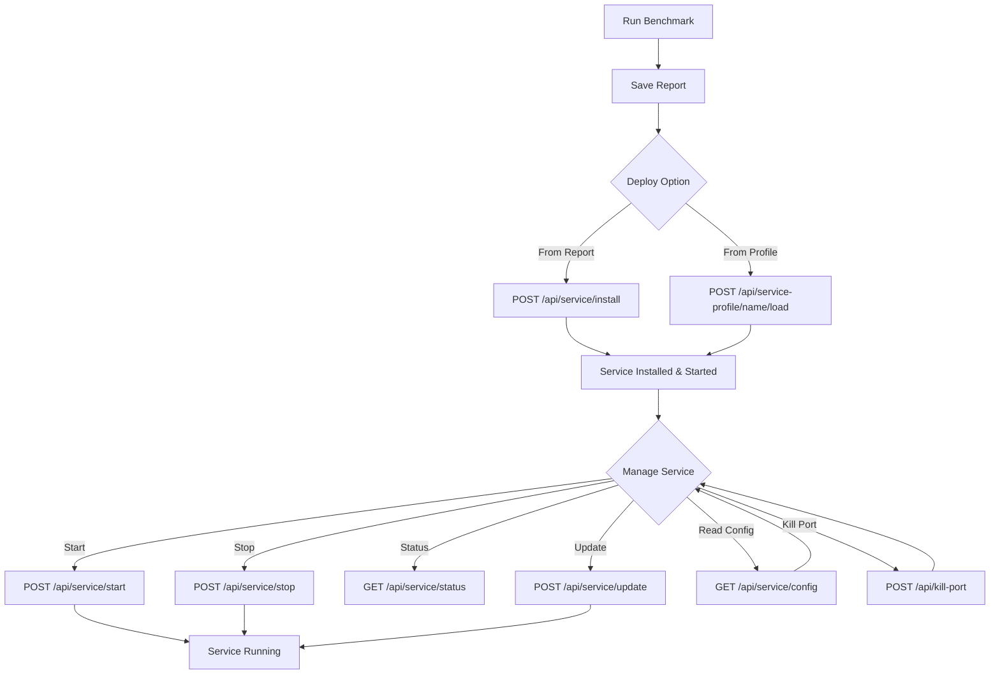

# Service Management

Deploy your benchmarked llama-server configuration as a persistent systemd user service.

> **Note:** Systemd service management requires Linux. Endpoints return `501 Not Implemented` on other platforms.

## Install a Service from a Report

The recommended approach: run a benchmark, find the best test run, install it as a service.

```bash
# Install service from a report's specific test run
curl -X POST http://localhost:3456/api/service/install \
  -H "Authorization: Bearer $TOKEN" \
  -H "Content-Type: application/json" \
  -d '{"reportName":"2024-06-20-llama-3-8b","testRunId":3}'

# Response:
# {
#   "success": true,
#   "message": "Service llama.service installed and started",
#   "serviceName": "llama.service",
#   "envFile": "/home/user/.config/systemd/user/llama-benchmark.env",
#   "serviceFile": "/home/user/.config/systemd/user/llama.service"
# }
```

This endpoint:

1. Reads the report and finds the specified test run's configuration
2. Reconstructs the `llama-server` launch command from the saved configs
3. Writes a systemd service file at `~/.config/systemd/user/llama.service`
4. Writes environment variables to `~/.config/systemd/user/llama-benchmark.env`
5. Stops any existing `llama.service`
6. Runs `systemctl --user daemon-reload`
7. Enables and starts the service

## Service Control

### Start

```bash
curl -X POST http://localhost:3456/api/service/start \
  -H "Authorization: Bearer $TOKEN"

# Response: {"success":true,"message":"llama.service started"}
```

### Stop

```bash
curl -X POST http://localhost:3456/api/service/stop \
  -H "Authorization: Bearer $TOKEN"

# Response: {"success":true,"message":"llama.service stopped"}
```

### Check Status

```bash
curl -H "Authorization: Bearer $TOKEN" \
  http://localhost:3456/api/service/status

# Response: {"success":true,"active":true}
# or:       {"success":true,"active":false}
```

## Service Configuration

### Read Current Config

```bash
curl -H "Authorization: Bearer $TOKEN" \
  http://localhost:3456/api/service/config

# Response:
# {
#   "success": true,
#   "exists": true,
#   "description": "Llama.cpp Benchmark Service - 2024-06-20-llama-3-8b (Run #3)",
#   "execStart": "/home/user/betty/llama.cpp/build/bin/llama-server -m /home/user/.betty/models/model.gguf ...",
#   "restart": "on-failure",
#   "restartSec": 5,
#   "envVars": {
#     "GGML_CUDA_ENABLE_UNIFIED_MEMORY": "1",
#     "CUDA_SCALE_LAUNCH_QUEUES": "4x",
#     "LLAMA_CACHE": "/home/user/betty/llama_cache",
#     "GGML_CUDA_P2P": "on",
#     "LLAMA_ARG_FIT": "on"
#   },
#   "serviceFile": "/home/user/.config/systemd/user/llama.service",
#   "envFile": "/home/user/.config/systemd/user/llama-benchmark.env"
# }
```

### Update Service Config

```bash
curl -X POST http://localhost:3456/api/service/update \
  -H "Authorization: Bearer $TOKEN" \
  -H "Content-Type: application/json" \
  -d '{
    "execStart": "/home/user/betty/llama.cpp/build/bin/llama-server -m /home/user/.betty/models/new-model.gguf --port 8080",
    "envVars": {
      "GGML_CUDA_ENABLE_UNIFIED_MEMORY": "1",
      "CUDA_SCALE_LAUNCH_QUEUES": "4x",
      "LLAMA_CACHE": "/home/user/betty/llama_cache",
      "GGML_CUDA_P2P": "on"
    },
    "restart": "always",
    "restartSec": 10
  }'

# Response: {"success":true,"message":"Service updated, reloaded, and restarted"}
```

This updates the service file, writes the env file, reloads systemd, and restarts the service.

## Service Profiles

Save and load service configurations independently of reports.

### Save a Service Profile

```bash
curl -X POST http://localhost:3456/api/service-profile \
  -H "Authorization: Bearer $TOKEN" \
  -H "Content-Type: application/json" \
  -d '{
    "name": "production-setup",
    "data": {
      "execStart": "/home/user/betty/llama.cpp/build/bin/llama-server -m /home/user/.betty/models/llama-3-8b.gguf --port 8080",
      "envVars": {
        "GGML_CUDA_ENABLE_UNIFIED_MEMORY": "1",
        "CUDA_SCALE_LAUNCH_QUEUES": "4x",
        "LLAMA_CACHE": "/home/user/betty/llama_cache",
        "GGML_CUDA_P2P": "on"
      },
      "restart": "always",
      "restartSec": 10
    }
  }'

# Response: {"success":true,"message":"Service profile saved"}
```

### List Service Profiles

```bash
curl -H "Authorization: Bearer $TOKEN" \
  http://localhost:3456/api/service-profiles

# Response:
# {
#   "success": true,
#   "data": [
#     {"name": "production-setup", "filename": "production-setup.json", "created": "...", "modified": "..."},
#     {"name": "dev-setup", "filename": "dev-setup.json", "created": "...", "modified": "..."}
#   ]
# }
```

### Load a Service Profile

```bash
# Load and restart the service
curl -X POST http://localhost:3456/api/service-profile/production-setup/load \
  -H "Authorization: Bearer $TOKEN"

# Load without restarting
curl -X POST "http://localhost:3456/api/service-profile/production-setup/load?restart=false" \
  -H "Authorization: Bearer $TOKEN"

# Response: {"success":true,"message":"Service profile loaded, reloaded, and restarted"}
```

### Delete a Service Profile

```bash
curl -X DELETE http://localhost:3456/api/service-profile/production-setup \
  -H "Authorization: Bearer $TOKEN"

# Response: {"success":true,"message":"Service profile deleted"}
```

## Kill Port Conflicts

If something is already using the llama-server port:

```bash
curl -X POST http://localhost:3456/api/kill-port \
  -H "Authorization: Bearer $TOKEN"

# Response:
# {
#   "success": true,
#   "message": "Killed 1 process(es) on port 11434",
#   "killed": ["12345"]
# }
```

Kills all processes on the configured `llama_port` (default 11434) with SIGKILL.

## Service Management Flow



## Service File Structure

The installed service file (`~/.config/systemd/user/llama.service`):

```ini
[Unit]
Description=Llama.cpp Benchmark Service - 2024-06-20-llama-3-8b (Run #3)
After=network.target

[Service]
Type=simple
User=youruser
EnvironmentFile=/home/youruser/.config/systemd/user/llama-benchmark.env
ExecStart=/home/youruser/betty/llama.cpp/build/bin/llama-server -m /home/youruser/.betty/models/model.gguf --port 11434 ...
Restart=on-failure
RestartSec=5
StandardOutput=journal
StandardError=journal
SyslogIdentifier=llama-benchmark

[Install]
WantedBy=default.target
```

## Related Pages

- [[qa/benchmark-workflow]] — Run benchmarks to find optimal settings
- [[qa/report-workflow]] — Save and view benchmark reports
- [[qa/api-usage]] — Full API reference
