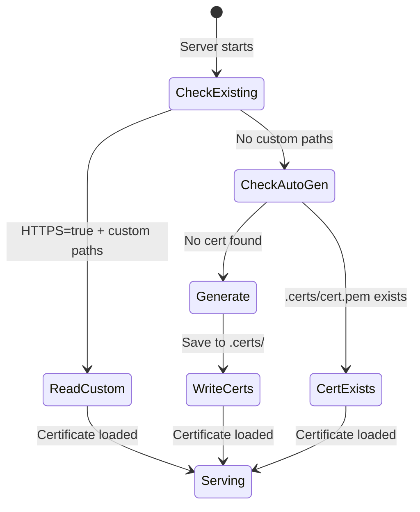

# HTTPS / TLS Configuration

## Summary

Betty supports HTTPS for secure communication between the browser and server. It can use either custom TLS certificates or auto-generate self-signed certificates for local development and testing.

## How It Works

The server uses Node.js's built-in `https` module. When HTTPS is enabled, a single port serves both HTTP/HTTPS requests and WebSocket connections:

```typescript
const useHttps = process.env.HTTPS === "true";

if (useHttps) {
  // Load or generate certificates
  const cert = fs.readFileSync(certFile);
  const key = fs.readFileSync(keyFile);
  server = https.createServer({ cert, key }, requestHandler);
} else {
  server = createServer(requestHandler);
}

// WebSocket server attaches to the same HTTP/HTTPS server
const wss = new WebSocketServer({ server });
```

## Modes

### 1. Custom Certificates (Production)

For production deployments, provide your own certificates:

```bash
# .env
HTTPS=true
HTTPS_CERT_PATH=/path/to/fullchain.pem
HTTPS_KEY_PATH=/path/to/privkey.pem

npm run start:prod
```

The server reads the certificate and key from the specified paths at startup.

### 2. Self-Signed Certificates (Development/Testing)

For local development, the server auto-generates a self-signed certificate:

```bash
# .env
HTTPS=true

npm run start:prod
```

On first start, the server:
1. Creates the `.certs/` directory if it doesn't exist
2. Generates a 2048-bit RSA key pair with SHA-256
3. Creates a certificate valid for `betty.local` for 365 days
4. Saves to `.certs/cert.pem` and `.certs/key.pem`

```typescript
const pems = selfsigned.generate(
  [{ name: "commonName", value: "betty.local" }],
  { keySize: 2048, days: 365, algorithm: "sha256" }
);
```

**Important:** Self-signed certificates are not trusted by browsers. You must manually trust them:

- **Chrome**: Visit `https://localhost:3001`, click "Advanced" → "Proceed to localhost"
- **Firefox**: Visit `https://localhost:3001`, click "Advanced" → "Accept the Risk and Continue"
- **Edge**: Same as Chrome

### 3. Reverse Proxy (Production Recommended)

For production, use a reverse proxy (nginx, Caddy, Traefik) for TLS termination:

```nginx
# nginx configuration
server {
    listen 443 ssl;
    server_name betty.example.com;

    ssl_certificate     /etc/letsencrypt/live/betty.example.com/fullchain.pem;
    ssl_certificate_key /etc/letsencrypt/live/betty.example.com/privkey.pem;

    location / {
        proxy_pass http://localhost:3001;
        proxy_http_version 1.1;
        proxy_set_header Upgrade $http_upgrade;
        proxy_set_header Connection "upgrade";
        proxy_set_header Host $host;
        proxy_set_header X-Real-IP $remote_addr;
        proxy_set_header X-Forwarded-For $proxy_add_x_forwarded_for;
        proxy_set_header X-Forwarded-Proto $scheme;
    }
}
```

With a reverse proxy, keep `HTTPS=false` in `.env` since the proxy handles TLS.

## Certificate Lifecycle



Certificates are **not** regenerated on subsequent starts if they already exist. This avoids browser certificate warnings from changing certificates.

## WebSocket Over HTTPS

WebSocket connections use the same port as HTTPS. The protocol is negotiated via the `Upgrade` header:

```
GET / HTTP/1.1
Host: betty.example.com
Upgrade: websocket
Connection: Upgrade
Sec-WebSocket-Key: dGhlIHNhbXBsZSBub25jZQ==
Sec-WebSocket-Version: 13
```

The `ws` library handles this automatically when attached to the HTTPS server.

## Security Notes

- Self-signed certificates should **never** be used in production
- Custom certificates should use Let's Encrypt or a trusted CA
- The private key file (`.certs/key.pem`) should be in `.gitignore`
- Consider adding authentication (see [[docs/audit.md]])

## Tags

- **category**: configuration, security, tls
- **component**: server.ts
- **pattern**: https, self-signed-cert, reverse-proxy
- **audience**: developers, engineers
