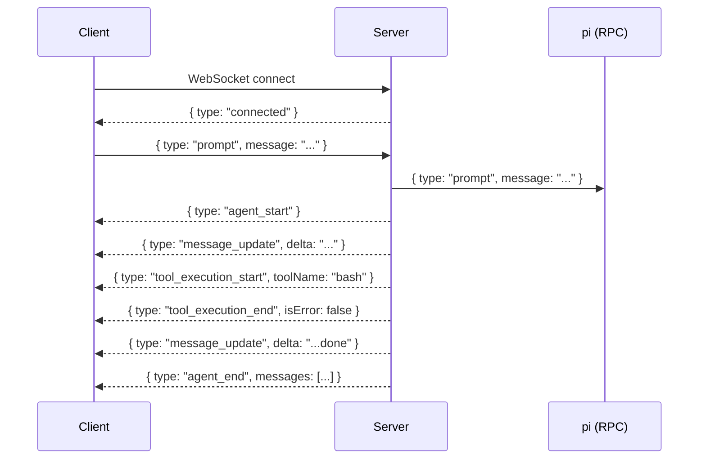
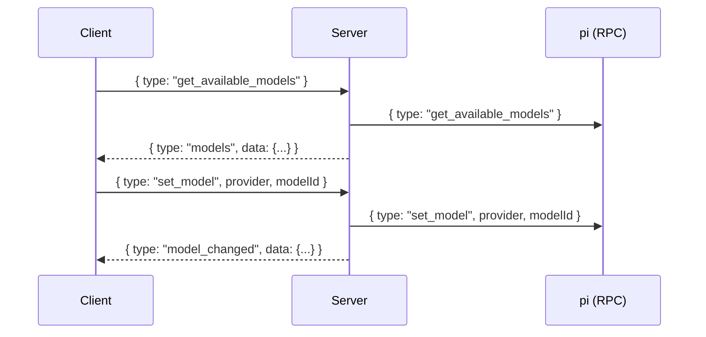

# WebSocket Protocol Reference

Complete specification of the client-server WebSocket message protocol.

## Summary

Betty uses a JSON-based WebSocket protocol for bidirectional communication. The server acts as a proxy between the Vue frontend and the pi coding agent's RPC mode.

## Connection

| Direction | Message | Description |
|-----------|---------|-------------|
| Server → Client | `{ type: "connected" }` | Sent immediately after connection is established |

**Connection URL:** `ws://<host>:<WS_PORT>` (default `ws://localhost:3001`)

## Client → Server Messages

All client messages are JSON objects with a `type` field identifying the command.

### Prompt

```json
{
  "type": "prompt",
  "message": "Explain how this project works",
  "images": [
    { "type": "image", "data": "<base64>", "mimeType": "image/png" }
  ],
  "streamingBehavior": "steer" | "followUp"
}
```

Sends a prompt to the AI agent. Optional `images` for multimodal input. Optional `streamingBehavior` for steering mode.

### Abort

```json
{ "type": "abort" }
```

Stops the currently streaming response.

### Model Management

```json
{ "type": "set_model", "provider": "anthropic", "modelId": "claude-sonnet-4-20250514" }
{ "type": "cycle_model" }
```

Set or cycle the active LLM model.

### Thinking Level

```json
{ "type": "set_thinking_level", "level": "high" }
{ "type": "cycle_thinking_level" }
```

Set or cycle the thinking level (`off`, `minimal`, `low`, `medium`, `high`, `xhigh`).

### Session Management

```json
{ "type": "new_session" }
{ "type": "compact", "customInstructions": "..." }
{ "type": "clone" }
{ "type": "fork", "entryId": "<entry-id>" }
{ "type": "switch_session", "sessionPath": "/path/to/session" }
{ "type": "set_session_name", "name": "My Session" }
```

Manage conversation sessions.

### State Queries

```json
{ "type": "get_state" }
{ "type": "get_messages" }
{ "type": "get_available_models" }
{ "type": "get_session_stats" }
{ "type": "get_fork_messages" }
{ "type": "get_commands" }
{ "type": "get_last_assistant_text" }
```

Query the current state of the pi agent.

### Steering & Follow-up

```json
{ "type": "steer", "message": "Focus on TypeScript", "images": [...] }
{ "type": "follow_up", "message": "Can you also explain X?", "images": [...] }
```

Send steering or follow-up messages within a conversation.

### Bash

```json
{ "type": "bash", "command": "ls -la" }
```

Execute a bash command through pi. Returns a `bash_result` event with output, exit code, and truncation info.

### Steering / Follow-Up Modes

```json
{ "type": "set_steering_mode", "mode": "on" | "off" }
{ "type": "set_follow_up_mode", "mode": "on" | "off" }
```

Control steering and follow-up modes for the agent.

### Auto Compaction

```json
{ "type": "set_auto_compaction", "enabled": true }
{ "type": "set_auto_compaction", "enabled": false }
```

Enable or disable automatic context compaction when approaching the context window limit.

### Auto Retry

```json
{ "type": "set_auto_retry", "enabled": true }
{ "type": "set_auto_retry", "enabled": false }
```

Enable or disable automatic retry of failed operations.

### Auto Retry Events

```json
{
  "type": "auto_retry_start",
  "toolCallId": "call_abc123",
  "toolName": "bash",
  "attempt": 2,
  "maxAttempts": 3
}
{
  "type": "auto_retry_end",
  "toolCallId": "call_abc123",
  "toolName": "bash",
  "success": true,
  "attempts": 2
}
```

Emitted when auto retry is triggered for a failed tool execution.

## Server → Client Events

### Streaming Events

```json
{
  "type": "message_update",
  "message": { "role": "assistant", "content": "..." },
  "assistantMessageEvent": {
    "type": "text_delta",
    "delta": "Hello",
    "contentIndex": 0
  }
}
```

Streaming text updates. The `assistantMessageEvent.type` can be:
- `text_delta` — Text content fragment
- `thinking_delta` — Thinking content fragment
- `toolcall_delta` — Tool call arguments
- `text_start` / `text_end` — Text block boundaries
- `thinking_start` / `thinking_end` — Thinking block boundaries
- `toolcall_start` / `toolcall_end` — Tool call boundaries
- `start` — Event stream start
- `done` — Event stream complete
- `error` — Error during streaming

### Agent Lifecycle

```json
{ "type": "agent_start" }
{ "type": "agent_end", "messages": [ /* WsAgentMessage[] */ ] }
{ "type": "turn_start" }
{ "type": "turn_end", "message": {...}, "toolResults": [...] }
```

Indicate agent processing state transitions.

### Tool Execution

```json
{
  "type": "tool_execution_start",
  "toolCallId": "call_abc123",
  "toolName": "bash",
  "args": { "command": "ls -la" }
}
{
  "type": "tool_execution_update",
  "toolCallId": "call_abc123",
  "toolName": "bash",
  "args": { "command": "ls -la" },
  "partialResult": { "content": [{ "type": "text", "text": "file1.txt\n" }] }
}
{
  "type": "tool_execution_end",
  "toolCallId": "call_abc123",
  "toolName": "bash",
  "result": { "content": [{ "type": "text", "text": "file1.txt\nfile2.ts\n" }] },
  "isError": false
}
```

Track tool execution progress and results.

### Compaction

```json
{ "type": "compaction_start", "reason": "context window full" }
{ "type": "compaction_end", "reason": "context window full", "result": {...}, "aborted": false, "willRetry": false }
```

Notify about context compaction events.

### Queue Update

```json
{
  "type": "queue_update",
  "steering": ["message1", "message2"],
  "followUp": ["message3"]
}
```

Notification of pending steering or follow-up messages.

### State & Data Responses

```json
{ "type": "state", "data": { "model": {...}, "thinkingLevel": "medium", ... } }
{ "type": "messages", "data": { "messages": [...] } }
{ "type": "models", "data": { "models": [...] } }
{ "type": "stats", "data": { "sessionFile": "...", "userMessages": 10, ... } }
{ "type": "fork_messages", "data": { "messages": [{ "entryId": "...", "text": "..." }] } }
{ "type": "commands", "data": { "commands": [{ "name": "...", "description": "...", "source": "..." }] } }
{ "type": "last_assistant_text", "data": { "text": "..." } }
```

Responses to state query commands. `last_assistant_text` returns the text content of the most recent assistant message.

### Session Events

```json
{ "type": "session_switched", "data": { "cancelled": false } }
```

Notification that a session switch completed.

### Model / Thinking Notifications

```json
{ "type": "model_changed", "data": { "model": {...} } }
{ "type": "thinking_level_changed", "data": { "level": "high" } }
{ "type": "bash_result", "data": { "output": "...", "exitCode": 0, "cancelled": false, "truncated": false, "fullOutputPath": "/tmp/betty-bash-abc123" } }
```

Notifications for model/thinking changes and bash results. The `bash_result` includes `fullOutputPath` when output is truncated.

### UI Requests

```json
{
  "type": "ui_request",
  "id": "req_123",
  "method": "confirm",
  "title": "Run command?",
  "message": "Execute: npm install",
  "options": ["Yes", "No"],
  "placeholder": "Enter confirmation...",
  "prefill": "Yes",
  "timeout": 30000
}
```

Extension UI requests from pi. The frontend responds via `{ type: "extension_ui_response", id, ... }`.

### Error

```json
{ "type": "error", "message": "Something went wrong" }
```

Error notification. Sets `wsError` in the store.

## Protocol Flow Diagrams

### Prompt Flow



### Model Switching Flow



## Tags

- **category**: protocol, websocket, reference
- **component**: server.ts, stores/chat.ts
- **pattern**: JSON-RPC, event-streaming, bidirectional
- **audience**: developers, engineers
