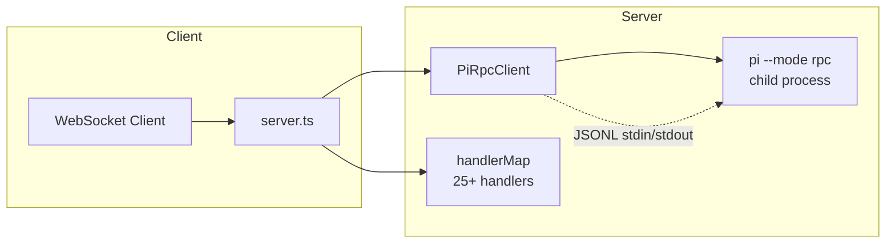
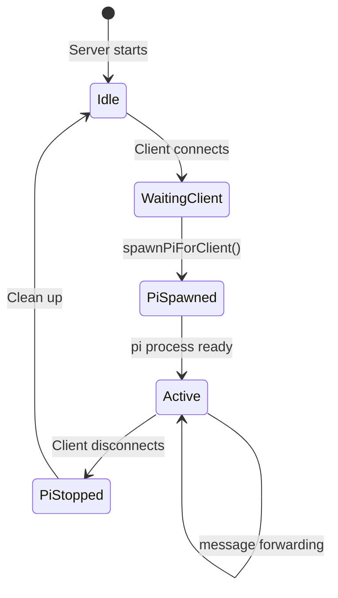

# Server (`server.ts`)

The Node.js backend that bridges WebSocket clients to the pi coding agent via RPC mode.

## Summary

The server spawns a `pi --mode rpc` child process per connected WebSocket client, forwards JSON messages bidirectionally, and exposes a health check endpoint. It handles 25+ command types including prompting, model switching, session management, and tool execution.

## Architecture



## Core Classes

### PiRpcClient

Manages a single `pi --mode rpc` process lifecycle.

| Property/Method | Type | Description |
|----------------|------|-------------|
| `start(options?)` | `Promise<void>` | Spawns the pi process with optional config |
| `stop()` | `void` | Kills the pi process via SIGINT |
| `send<T>(command)` | `Promise<T>` | Sends an RPC command, returns typed response |
| `onEvent(fn)` | `void` | Registers an event listener for non-response messages |
| `onUiRequest(id, handler)` | `void` | Registers a handler for extension UI requests |
| `respondToUiRequest(id, response)` | `void` | Responds to a pending UI request |
| `isRunning` | `boolean` | Whether the pi process is active |

**`start()` options:**

| Option | Type | Description |
|--------|------|-------------|
| `provider` | `string` | LLM provider (e.g., `anthropic`, `openai`) |
| `model` | `string` | Model ID |
| `noSession` | `boolean` | Disable session persistence |
| `sessionDir` | `string` | Custom session storage directory |
| `thinkingLevel` | `string` | Thinking level setting |
| `apikey` | `string` | API key |
| `verbose` | `boolean` | Enable verbose stderr logging |

**RPC protocol:** The client communicates with pi via JSONL on stdin/stdout. Each line is a JSON object with `type`, `id`, and command-specific fields. Responses echo back with matching `id`.

### handlerMap

A `Record<string, () => Promise<void>>` mapping WebSocket command types to async handlers. Each handler:

1. Constructs the appropriate RPC command
2. Calls `pi.send(command)`
3. Optionally sends a response event back to the WebSocket client

## WebSocket Command Reference

See [[docs/reference/protocol.md]] for the complete protocol specification.

## Server Configuration

Read from environment variables:

| Variable | Default | Description |
|----------|---------|-------------|
| `WS_PORT` | `3001` | WebSocket server port |
| `HTTP_PORT` | `3000` | HTTP health check port |
| `PI_PROVIDER` | — | LLM provider |
| `PI_MODEL` | — | Model ID |
| `PI_NO_SESSION` | `false` | Disable session persistence |
| `PI_SESSION_DIR` | — | Custom session storage directory |
| `PI_THINKING_LEVEL` | — | Thinking level |
| `PI_VERBOSE` | `false` | Enable verbose logging |
| `ANTHROPIC_API_KEY` | — | Anthropic API key |
| `OPENAI_API_KEY` | — | OpenAI API key |

## API Endpoints

### `GET /health`

Returns server health status.

```json
{ "status": "ok", "wsClients": 3 }
```

### WebSocket (`ws://host:3001`)

Bidirectional JSON message channel. See [[docs/reference/protocol.md]].

## Lifecycle



## Tags

- **category**: backend, server
- **component**: PiRpcClient, handlerMap, WebSocketServer
- **pattern**: process-per-client, JSONL-RPC
- **audience**: developers, engineers
