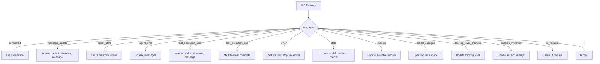

# Chat Store (`stores/chat.ts`)

Pinia store managing all WebSocket communication and chat state.

## Summary

The `useChatStore` Pinia store is the central state manager for the Betty frontend. It maintains the WebSocket connection lifecycle, normalizes raw WebSocket events into structured state updates, and provides actions for all user operations.

## State

| State | Type | Default | Description |
|-------|------|---------|-------------|
| `messages` | `Ref<ChatMessage[]>` | `[]` | Chat message history |
| `isStreaming` | `Ref<boolean>` | `false` | Whether an agent is responding |
| `wsConnected` | `Ref<boolean>` | `false` | WebSocket connection status |
| `wsError` | `Ref<string \| null>` | `null` | Last error message |
| `currentModel` | `Ref<ModelOption \| null>` | `null` | Currently selected model |
| `availableModels` | `Ref<ModelOption[]>` | `[]` | All available models |
| `thinkingLevel` | `Ref<string>` | `"medium"` | Current thinking level |
| `sessionId` | `Ref<string \| null>` | `null` | Current session ID |
| `sessionName` | `Ref<string \| null>` | `null` | Current session name |
| `messageCount` | `Ref<number>` | `0` | Total message count |
| `pendingMessageCount` | `Ref<number>` | `0` | Pending message count |
| `uiRequests` | `Ref<WsUiRequest[]>` | `[]` | Pending UI requests from pi |
| `showSidebar` | `Ref<boolean>` | `false` | Sidebar visibility |
| `showModelSelector` | `Ref<boolean>` | `false` | Model selector modal visibility |
| `showSettings` | `Ref<boolean>` | `false` | Settings modal visibility |
| `showCompactDialog` | `Ref<boolean>` | `false` | Compact dialog visibility |
| `compactInstructions` | `Ref<string>` | `""` | Custom compaction instructions |
| `showNewSessionConfirm` | `Ref<boolean>` | `false` | Confirm clear dialog visibility |

## Computed Properties

### `lastAssistantMessage`

Returns the most recent assistant message by iterating backwards through the message list. Returns `null` if no assistant messages exist.

```typescript
const lastAssistantMessage = computed(() => {
  for (let i = messages.value.length - 1; i >= 0; i--) {
    if (messages.value[i].role === "assistant") return messages.value[i];
  }
  return null;
});
```

### `lastUserMessage`

Returns the most recent user message by iterating backwards. Returns `null` if no user messages exist.

```typescript
const lastUserMessage = computed(() => {
  for (let i = messages.value.length - 1; i >= 0; i--) {
    if (messages.value[i].role === "user") return messages.value[i];
  }
  return null;
});
```

## Actions

### Connection Management

| Action | Description |
|--------|-------------|
| `connect()` | Opens WebSocket connection with auto-reconnect (2s delay on disconnect) |
| `send(msg)` | Sends a raw JSON message through the WebSocket |

**`connect()` behavior:**
- Returns early if connection is already open
- Sets `wsConnected = true` on open
- Parses incoming messages and dispatches to `handleWsMessage()`
- Auto-reconnects after 2 seconds on close
- Sets `wsError` on close and error events

### Message Actions

| Action | Description |
|--------|-------------|
| `sendMessage(text, images?)` | Sends a user message; adds user + placeholder assistant messages locally |
| `abort()` | Sends abort signal to stop streaming |
| `clearMessages()` | Clears the message list locally |

**`sendMessage()` flow:**
1. Returns early if text is empty or streaming
2. Creates a `ChatMessage` for the user and pushes to `messages`
3. Creates a placeholder assistant message with `isStreaming: true`
4. Sends `{ type: "prompt", message, images }` via WebSocket

### Model Actions

| Action | Description |
|--------|-------------|
| `setModel(provider, modelId)` | Switches to the specified model |
| `cycleModel()` | Cycles to the next available model |
| `getAvailableModels()` | Fetches the list of available models |

### Thinking Level Actions

| Action | Description |
|--------|-------------|
| `setThinkingLevel(level)` | Sets the thinking level |
| `cycleThinkingLevel()` | Cycles through thinking levels |

### Session Actions

| Action | Description |
|--------|-------------|
| `newSession()` | Creates a new session; clears messages and session state |
| `compact(customInstructions?)` | Compresses conversation context |
| `switchSession(sessionPath)` | Switches to a different session |
| `setSessionName(name)` | Sets the session name |
| `clone()` | Clones the current session |
| `fork(entryId)` | Forks the conversation at a specific entry |
| `getSessionStats()` | Fetches session statistics |
| `getForkMessages()` | Fetches messages available for forking |
| `getCommands()` | Fetches available pi commands |

### State Query Actions

| Action | Description |
|--------|-------------|
| `getState()` | Fetches current server state |
| `getMessages()` | Fetches the full message history |

### UI Actions

| Action | Description |
|--------|-------------|
| `respondToUiRequest(id, response)` | Responds to a pi extension UI request |
| `dismissUiRequest(id)` | Removes a UI request from the queue |

## Event Handling: `handleWsMessage()`

The central event dispatcher. Routes incoming WebSocket events by `type`:



### Message Update Handling

The `message_update` event is the most complex, handling multiple sub-events via `assistantMessageEvent.type`:

| Sub-event | Behavior |
|-----------|----------|
| `text_delta` | Appends `delta` to the current streaming assistant message's content |
| `thinking_delta` | Appends `delta` to a thinking block (wrapped in `<details>`) |
| `toolcall_delta` | No direct handling; tool calls managed via `tool_execution_start/end` |
| `done` | Marks streaming message as complete, sets `isStreaming = false` |
| `error` | Marks streaming message as complete, sets `isStreaming = false` |

## WebSocket URL Configuration

```typescript
const wsUrl = import.meta.env.VITE_WS_URL || `ws://${location.hostname}:3001`;
```

Can be overridden via `.env` file (`VITE_WS_URL`).

## Tags

- **category**: frontend, state-management
- **component**: Pinia store, WebSocket client
- **pattern**: event-dispatch, auto-reconnect, streaming
- **audience**: developers, engineers
