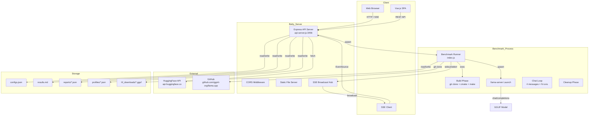
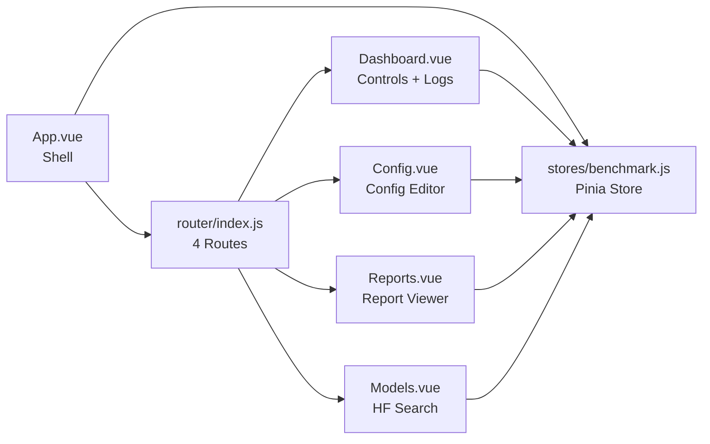
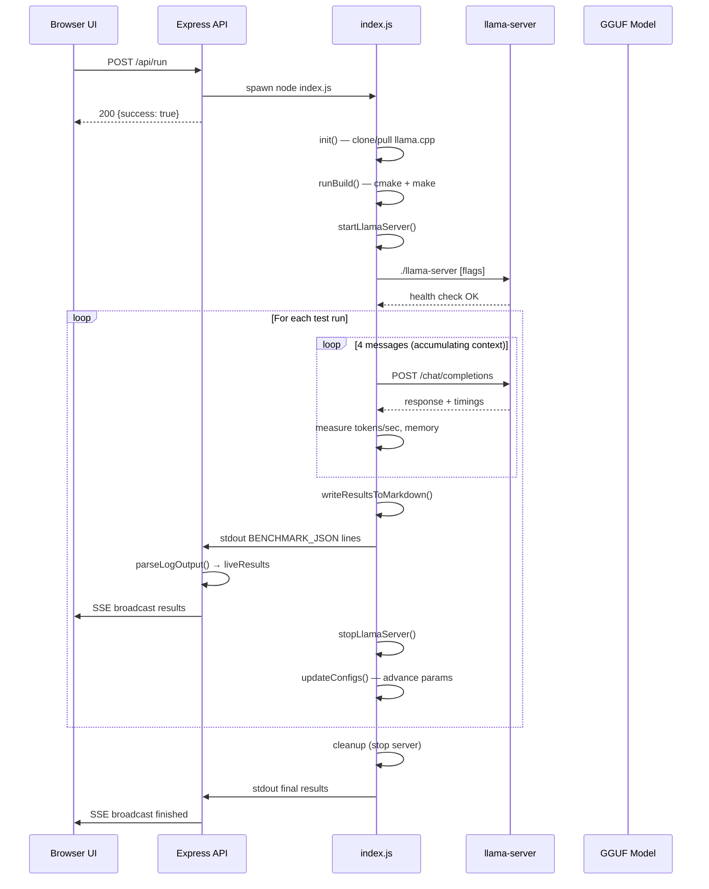
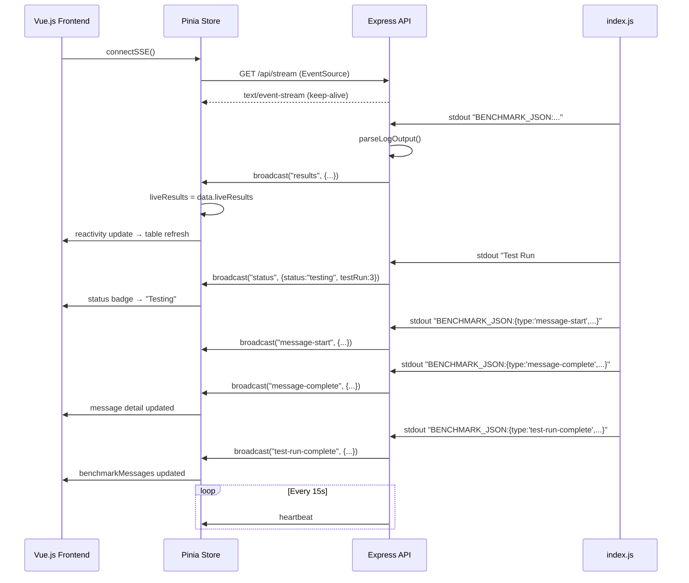
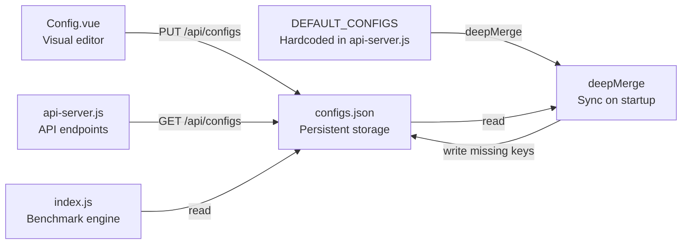

# Betty Architecture

This page covers the system architecture, data flow, and component relationships of the Betty benchmarking platform.

## System Architecture

## Component Relationships

## Data Flow

### Benchmark Execution Flow

### SSE Real-Time Update Flow

## SSE Streaming Architecture

The SSE system is the backbone of Betty's real-time UX. It operates on two independent channels:

### Main Benchmark Stream (`GET /api/stream`)

| Event | Trigger | Payload |
|-------|---------|---------|
| `status` | Test run starts/completes/error | `{status, testRun, liveResults, finished?}` |
| `results` | Summary block flushed | `{liveResults}` |
| `message-start` | Chat message sent | `{testRunId, messageIndex, prompt}` |
| `message-complete` | LLM response received | `{testRunId, messageIndex, prompt, response, promptTokens, generatedTokens, totalTimeMs}` |
| `test-run-complete` | All 4 messages done | `{testRunId, messages}` |
| `log` | stdout/stderr line | `{type: "stdout"\|"stderr", text, status, testRun, liveResults}` |
| `heartbeat` | Every 15 seconds | `{ts}` |

### Build Stream (`POST /api/build`)

| Event | Trigger | Payload |
|-------|---------|---------|
| `build-log` | Build output line | `{line text}` |
| `build-log` | Progress tick | `PROGRESS:{0-90}` |
| `build-log` | Success | `STATUS:Build complete!` |
| `build-log` | Failure | `STATUS:Build failed\nERROR: {message}` |

### Download Stream (`POST /api/hf/download`)

| Event | Trigger | Payload |
|-------|---------|---------|
| `hf-download` | Progress update | `PROGRESS:{percent}:{bytes}` |
| `hf-download` | Complete | `STATUS:Download complete\nFILE:{path}` |
| `hf-download` | Failure | `STATUS:Download failed\nERROR: {message}` |

## Configuration System

### Config Flow

1. **Startup**: `api-server.js` loads `configs.json`, merges missing keys from `DEFAULT_CONFIGS`
2. **Edit**: Config.vue reads via `GET /api/configs`, edits visually, saves via `PUT /api/configs`
3. **Run**: `index.js` reads `configs.json` on startup, passes values to cmake/llama-server
4. **Profile**: Save/Load creates/deletes JSON files in `profiles/` directory
5. **Report**: Auto-saves after each test run with full per-run configuration

### Environment Variables

The benchmark engine sets these environment variables for the llama.cpp build and runtime:

| Variable | Purpose | Default |
|----------|---------|---------|
| `GGML_CUDA_ENABLE_UNIFIED_MEMORY` | CUDA unified memory | `1` |
| `CUDA_SCALE_LAUNCH_QUEUES` | Queue scaling factor | `4x` |
| `LLAMA_CACHE` | KV cache path | `llama_cache` |
| `GGML_CUDA_P2P` | Peer-to-peer access | `on` |
| `LLAMA_ARG_FIT` | Fit mode | `on` |
| `LLAMA_ARG_FIT_TARGET` | Fit target size | `256` |
| `LLAMA_ARG_FIT_CTX` | Fit context size | `131072` |
| `CUDACXX` | NVCC compiler path | `/usr/local/cuda/bin/nvcc` |

## See Also

- [[betty-project]] — Project overview
- [[betty-api-reference]] — API endpoint documentation
- [[betty-benchmark-engine]] — Benchmark engine internals
- [[betty-configuration]] — Configuration system details

## Tags

betty, architecture, sse, express, llama.cpp, configuration, data-flow
