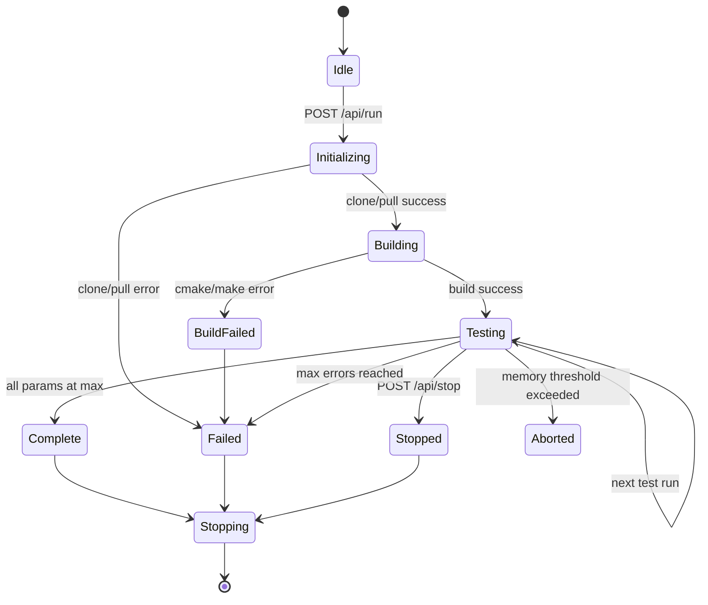
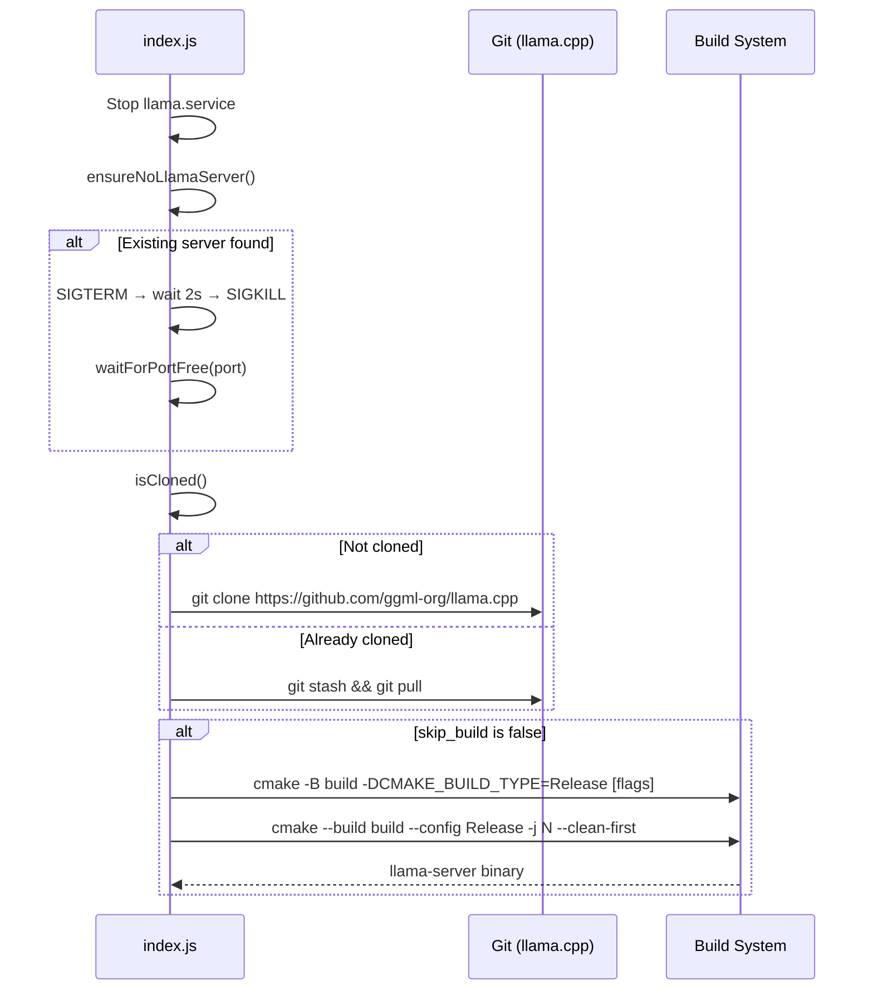
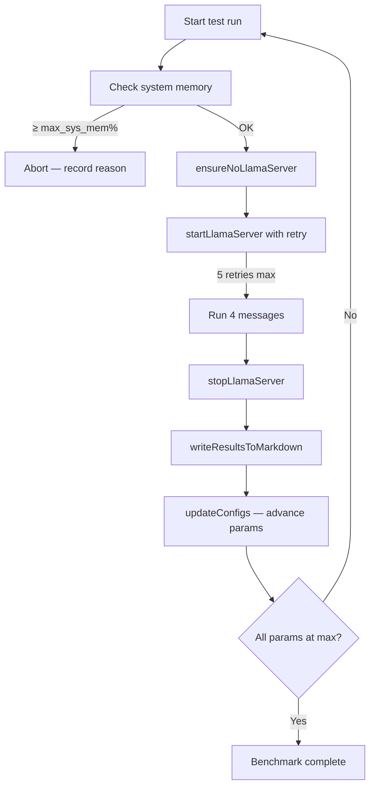
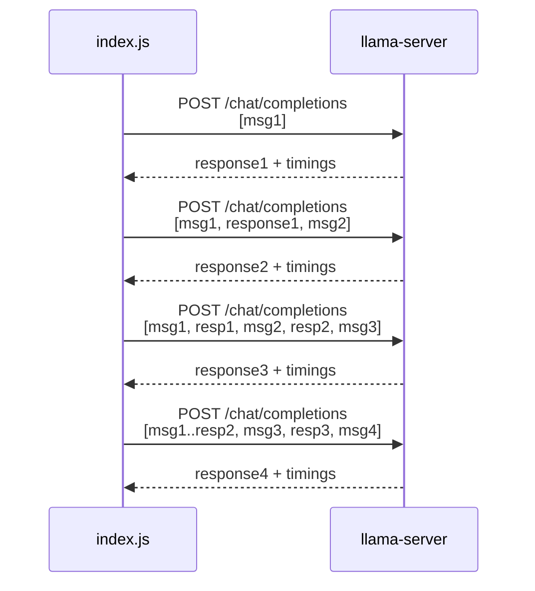
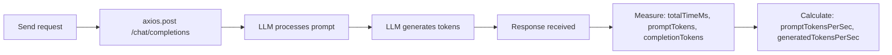
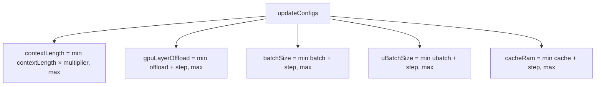
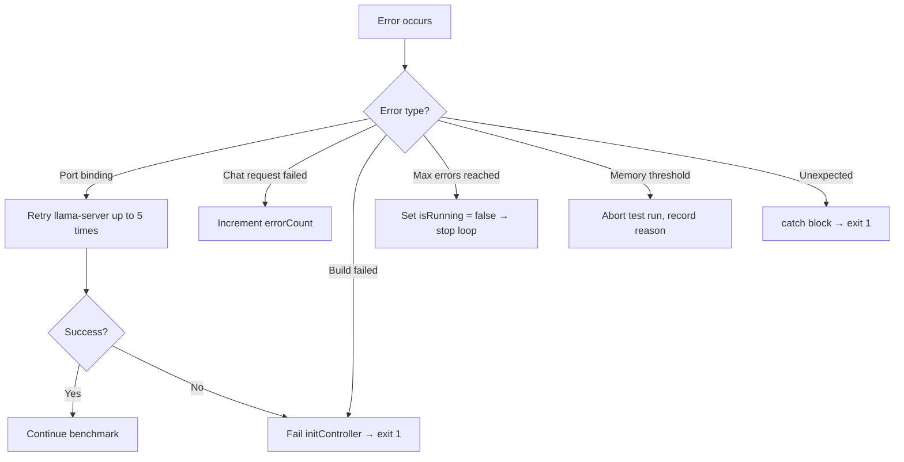
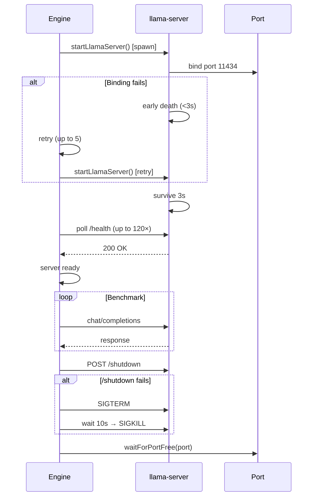

# Betty Benchmark Engine

The benchmark engine (`index.js`) orchestrates the full benchmark lifecycle: initialization, building llama.cpp, running test iterations, and producing results.

## Lifecycle Overview



## Phase 1: Initialization



### Key Functions

| Function | Purpose |
|----------|---------|
| `main()` | Entry point — orchestrates init → build → test loop → cleanup |
| `initController()` | Calls `init()` then `runBuild()` |
| `init()` | Clones or pulls llama.cpp repository |
| `isCloned()` | Checks if `llama.cpp/` directory exists |
| `runBuild()` | Runs cmake configure + make build |
| `runClone()` | `git clone https://github.com/ggml-org/llama.cpp` |
| `runPull()` | `git stash && git pull` in existing repo |
| `ensureNoLlamaServer()` | Kills any existing llama-server processes |
| `waitForPortFree(port)` | Waits for port to be free (handles TIME_WAIT) |

## Phase 2: Test Loop



### Test Run Structure

Each test run sends **4 sequential messages** to the llama-server chat endpoint, accumulating context each turn:



The messages are defined in `configs.benchmark_messages`:
1. "Develop a design doc for a self-hosted tetris clone web-based game."
2. "Audit the design doc."
3. "Recommend optimizations."
4. "Create a social-media marketing campaign for it."

### Message Timing



## Phase 3: Configuration Advancement

Between test runs, the engine advances test parameters to explore the configuration space:



### Test Parameters (from `configs.test_params`)

| Parameter | Default | Step | Max | Effect |
|-----------|---------|------|-----|--------|
| `context_length` | 32,768 | ×2 (multiplier) | 262,144 | Maximum context window |
| `context_length_multiplier` | 2 | — | — | Multiplier for each run |
| `gpu_layer_offload` | 999 | 0 | 999 | Layers offloaded to GPU |
| `batch_size` | 128 | +128 | 16,384 | Batch size for prompt processing |
| `u_batch_size` | 64 | +64 | 4,096 | Ubatch size for generation |
| `cache_ram` | 4,096 GB | +1,024 | 4,096 GB | RAM cache for prompt |

### Termination Conditions

The benchmark stops when:
1. **All parameters at maximum**: `areAllVariablesAtMax()` returns true
2. **Error threshold**: `errorCount >= maxErrors` (10)
3. **Memory threshold**: System memory usage ≥ `max_sys_mem` (default 93%)
4. **Manual stop**: `POST /api/stop` received

## Phase 4: Results Output

### Per-Message Metrics

For each of the 4 messages:
- `promptTokens` — tokens in the prompt
- `generatedTokens` — tokens generated by the model
- `totalTimeMs` — total request time
- `promptTimeMs` — time for prompt processing
- `predictedTimeMs` — time for token generation
- `promptTokensPerSec` — throughput for prompt processing
- `generatedTokensPerSec` — throughput for generation
- `mem` — system memory at time of request

### Per-Test-Run Averages

```javascript
{
  testRunId: N,
  contextLength: ...,
  batchSize: ...,
  uBatchSize: ...,
  cacheRam: ...,
  gpuLayerOffload: ...,
  averages: {
    totalPromptTokens: sum(all messages),
    totalGeneratedTokens: sum(all messages),
    totalTimeMs: sum(all messages),
    avgPromptTokensPerSec: mean of per-message rates,
    avgGenTokensPerSec: mean of per-message rates,
    avgMemUsed: mean of per-message memory,
    avgMemTotal: total system memory
  }
}
```

### Markdown Output (`results.md`)

The engine writes 5 tables to `results.md`:

1. **Per-Message Results** — individual message metrics
2. **Test Run Averages** — aggregated per-run metrics
3. **Server Parameters** — model/server config per run
4. **CMake Build Flags** — build flags per run
5. **Environment Variables** — env vars per run

```
# llama.cpp Benchmark Results

Generated: 2026-06-17T14:30:00.000Z
Model: hf_downloads/model.gguf

## Per-Message Results
| Test Run | Message | Context Len | Messages in Context | Prompt Tokens | Generated Tokens | Total Time (ms) | Prompt Tokens/sec | Gen Tokens/sec | Memory (GB) |
|----------|---------|-------------|---------------------|---------------|------------------|-----------------|-------------------|----------------|-------------|
| 1 | 1 | 32768 | 1 | 1234 | 5678 | 12345 | 100.5 | 460.2 | 8 / 64 GB |
...
```

## Error Handling



Key error handling patterns:
- **Port binding**: 5 retries with 2s delay between attempts; checks for `couldn't bind` and `HTTP server error`
- **Health polling**: After 3s survival, polls `/health` up to 120 times (2 minutes)
- **Port cleanup**: `waitForPortFree()` checks TIME_WAIT state, force-kills leftover processes
- **Error threshold**: `maxErrors = 10` — benchmark stops after 10 errors
- **Signal handlers**: SIGTERM/SIGINT trigger graceful shutdown via `stopLlamaServer()`
- **Uncaught exceptions**: Caught and trigger shutdown

## Server Lifecycle



## CLI Flags

| Flag | Effect |
|------|--------|
| `--no-build` | Skip llama.cpp build phase |
| `--build-only` | Build llama.cpp then exit (no benchmark) |

## Environment Variables

| Variable | Purpose | Default |
|----------|---------|---------|
| `GGML_CUDA_ENABLE_UNIFIED_MEMORY` | Enable CUDA unified memory | `1` |
| `CUDA_SCALE_LAUNCH_QUEUES` | Scale launch queues | `4x` |
| `LLAMA_CACHE` | KV cache directory | `llama_cache` |
| `GGML_CUDA_P2P` | Enable peer-to-peer | `on` |
| `LLAMA_ARG_FIT` | Enable fit mode | `on` |
| `LLAMA_ARG_FIT_TARGET` | Fit target size | `256` |
| `LLAMA_ARG_FIT_CTX` | Fit context size | `131072` |
| `CUDACXX` | NVCC path | `/usr/local/cuda/bin/nvcc` |

## See Also

- [[betty-architecture]] — System architecture
- [[betty-configuration]] — Configuration system
- [[betty-api-reference]] — API endpoints that trigger the engine

## Tags

betty, benchmark, llama.cpp, performance, metrics, cuda
