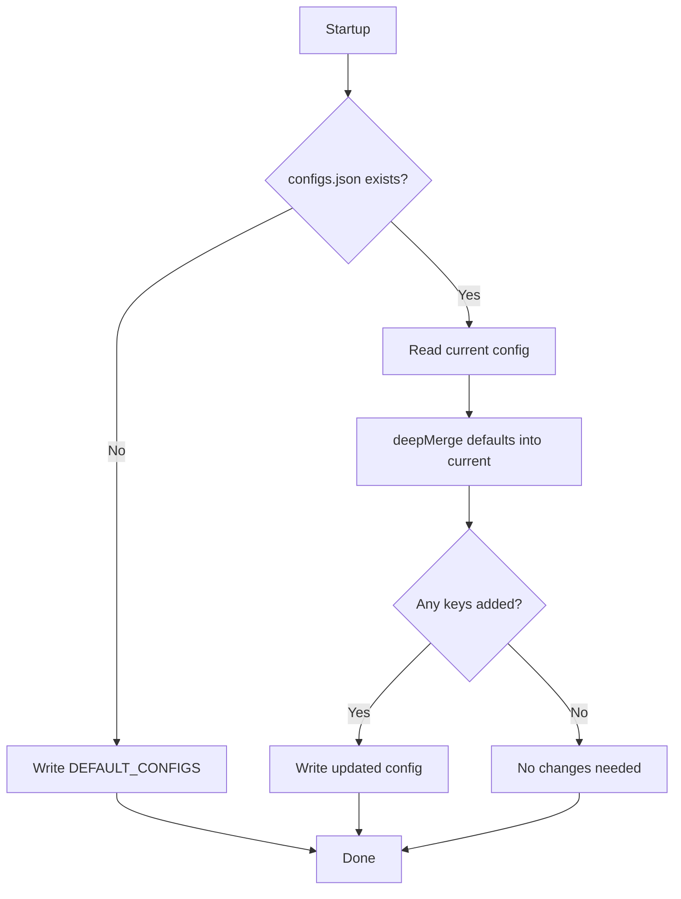
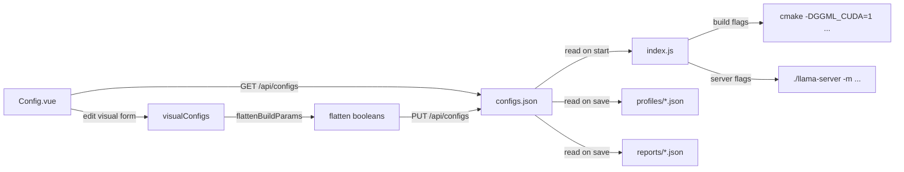

# Betty Configuration System

The configuration system manages all benchmark parameters through a JSON file (`configs.json`) with automatic default merging, profile management, and flow from UI to benchmark process.

## Configuration File (`configs.json`)

Located at `src/benchmark/configs.json`. Loaded on every API request and benchmark run.

### Structure

```json
{
  "export_configs": { ... },
  "max_sys_mem": 93,
  "llama_port": 11434,
  "llama_host": "localhost",
  "model": "path/to/model.gguf",
  "model_directory": "hf_downloads",
  "llama_cache": "llama_cache",
  "gpu_selection": { ... },
  "split_params": { ... },
  "spec_params": { ... },
  "build_cores": 14,
  "skip_build": true,
  "build_make_params": { ... },
  "cuda_configs": { ... },
  "model_configs": { ... },
  "server_params": { ... },
  "benchmark_messages": [ ... ],
  "test_params": { ... }
}
```

### Section Reference

#### `export_configs` — CUDA Environment Variables

Environment variables passed to the llama.cpp build and runtime:

| Key | Type | Default | Description |
|-----|------|---------|-------------|
| `GGML_CUDA_ENABLE_UNIFIED_MEMORY` | string | `"1"` | Enable CUDA unified memory allocation |
| `CUDA_SCALE_LAUNCH_QUEUES` | string | `"4x"` | Scale factor for CUDA launch queues |
| `LLAMA_CACHE` | string | `"llama_cache"` | KV cache directory path |
| `GGML_CUDA_P2P` | string | `"on"` | Enable GPU peer-to-peer access |
| `LLAMA_ARG_FIT` | string | `"on"` | Enable fit mode |
| `LLAMA_ARG_FIT_TARGET` | string | `"256"` | Fit target size |
| `LLAMA_ARG_FIT_CTX` | string | `"131072"` | Fit context size |

#### General Settings

| Key | Type | Default | Description |
|-----|------|---------|-------------|
| `max_sys_mem` | number | `93` | Max system memory % before aborting |
| `llama_port` | number | `11434` | llama-server listening port |
| `llama_host` | string | `"localhost"` | llama-server host |
| `model` | string | `""` | Model filename (relative to model_directory) |
| `model_directory` | string | `"hf_downloads"` | Directory containing GGUF models |
| `llama_cache` | string | `"llama_cache"` | KV cache directory |
| `build_cores` | number | `1` | Number of CPU cores for build |
| `skip_build` | boolean | `false` | Skip llama.cpp build phase |

#### `gpu_selection` — Multi-GPU Configuration

| Key | Type | Default | Description |
|-----|------|---------|-------------|
| `gpu_selection.enabled` | boolean | `false` | Enable multi-GPU mode |
| `gpu_selection.gpus` | number[] | `[0]` | GPU device IDs |

When enabled with multiple GPUs, tensor split is auto-calculated as equal distribution (e.g., 3 GPUs → `"33,33,34"`).

#### `split_params` — GPU Split Configuration

| Key | Type | Default | Description |
|-----|------|---------|-------------|
| `split_params.layer_split.enabled` | boolean | `false` | Enable layer split mode |
| `split_params.layer_split.value` | string | `"layer"` | Split mode value |
| `split_params.tensor_split.enabled` | boolean | `false` | Enable tensor split |
| `split_params.tensor_split.value` | string | `"16,12,12"` | Tensor split values |
| `split_params.primary_gpu.enabled` | boolean | `false` | Set primary GPU |
| `split_params.primary_gpu.value` | number | `0` | Primary GPU device ID |

#### `spec_params` — Speculative Decoding

| Key | Type | Default | Description |
|-----|------|---------|-------------|
| `spec_params.spec_type.enabled` | boolean | `false` | Enable speculative decoding |
| `spec_params.spec_type.value` | string | `"draft-mtp"` | Speculative type |
| `spec_params.spec_draft_n_max.enabled` | boolean | `false` | Enable draft N-max |
| `spec_params.spec_draft_n_max.value` | number | `3` | Max draft tokens |

#### `build_make_params` — CMake Build Flags

| Key | Type | Default | Description |
|-----|------|---------|-------------|
| `enable_ccache` | boolean/string | `true` | Enable ccache |
| `enable_lto` | boolean/string | `true` | Enable link-time optimization |
| `enable_cuda` | boolean/string | `true` | Enable CUDA backend |
| `enable_cuda_fa` | boolean/string | `true` | Enable Flash Attention |
| `enable_cuda_graphs` | boolean | `true` | Enable CUDA Graphs |
| `enable_cuda_nccl` | boolean/string | `true` | Enable NCCL |
| `enable_cuda_per_max_batch_size` | boolean/string | `true` | Enable per-max batch size |
| `peer_batch_size` | string | `"512"` | Peer max batch size value |
| `enable_cuda_peer_copy` | boolean/string | `true` | Enable peer copy |
| `enable_cuda_custom_arch` | boolean | `true` | Enable custom CUDA architecture |
| `enable_cuda_fa_all_quants` | boolean/string | `true` | Enable FA all quants |
| `cuda_all_quants` | boolean/string | `true` | CUDA all quants value |
| `enable_cuda_fp16` | boolean | `true` | Enable FP16 |
| `cuda_fp16` | boolean/string | `true` | FP16 value |
| `enable_cuda_scheduled_max_copies` | boolean/string | `true` | Enable scheduled max copies |
| `cuda_max_scheduled_copies` | number | `14` | Max scheduled copies |
| `enable_cuda_compression_level` | boolean | `false` | Enable compression level |
| `cuda_compression_level` | number | `0` | Compression level |
| `enable_ggml_cuda_force_mmq` | boolean | `false` | Force MMQ |
| `enable_ggml_native` | boolean | `false` | Native architecture |

**Mutual exclusion:** `enable_ggml_native` and `enable_cuda_custom_arch` are mutually exclusive — enabling one disables the other.

#### `cuda_configs` — CUDA Toolkit Configuration

| Key | Type | Default | Description |
|-----|------|---------|-------------|
| `cuda_version` | string | `"12.6"` | CUDA toolkit version |
| `cudacxx` | string | `"/usr/local/cuda/bin/nvcc"` | NVCC compiler path |

#### `model_configs` — Model Inference Parameters

| Key | Type | Default | Description |
|-----|------|---------|-------------|
| `temp` | number | `0.6` | Sampling temperature |
| `top_p` | number | `0.95` | Nucleus sampling threshold |
| `min_p` | number | `0` | Minimum probability threshold |
| `top_k` | number | `20` | Top-K sampling |

#### `server_params` — llama-server Launch Parameters

| Key | Type | Default | Description |
|-----|------|---------|-------------|
| `cont_batching` | boolean | `true` | Continuous batching |
| `flash_attn.enabled` | boolean | `true` | Flash Attention |
| `flash_attn.value` | number | `1` | Flash Attention value |
| `reasoning.enabled` | boolean | `true` | Reasoning mode |
| `reasoning.value` | number | `1` | Reasoning value |
| `profiling` | boolean | `true` | Enable profiling (`-e`) |
| `presence_penalty.enabled` | boolean | `true` | Presence penalty |
| `presence_penalty.value` | number | `0` | Penalty value |
| `reasoning_budget.enabled` | boolean | `true` | Reasoning budget |
| `reasoning_budget.value` | number | `2048` | Budget in tokens |
| `reasoning_budget_message.enabled` | boolean | `true` | Budget message |
| `reasoning_budget_message.value` | string | `"Proceed to final answer."` | Budget message text |
| `rope_scaling.enabled` | boolean | `true` | RoPE scaling |
| `rope_scaling.value` | string | `"yarn"` | Scaling method |
| `jinja` | boolean | `false` | Jinja template |
| `parallel.enabled` | boolean | `true` | Parallel requests |
| `parallel.value` | number | `1` | Parallel count |
| `n_predict.enabled` | boolean | `false` | Max prediction tokens |
| `n_predict.value` | number | `512` | Prediction limit |
| `n_keep.enabled` | boolean | `false` | Keep tokens |
| `n_keep.value` | number | `0` | Keep count |
| `stream.enabled` | boolean | `true` | Streaming |
| `stream.value` | boolean | `false` | Stream value |
| `cache_prompt.enabled` | boolean | `true` | Cache prompt |
| `cache_prompt.value` | boolean | `true` | Cache value |
| `gpu_layers.enabled` | boolean | `true` | GPU layer offload |
| `gpu_layers.value` | number | `999` | Max layers to offload |

#### `benchmark_messages` — Test Prompts

Array of 4 strings used as sequential chat messages during benchmarking:

```json
[
  "Develop a design doc for a self-hosted tetris clone web-based game.",
  "Audit the design doc.",
  "Recommend optimizations.",
  "Create a social-media marketing campaign for it."
]
```

#### `test_params` — Test Parameter Ranges

| Key | Type | Default | Description |
|-----|------|---------|-------------|
| `context_length` | number | `32768` | Starting context length |
| `context_length_multiplier` | number | `2` | Multiplier per run |
| `context_length_max` | number | `262144` | Maximum context length |
| `gpu_layer_offload` | number | `999` | Starting GPU layers |
| `gpu_layer_offload_step` | number | `0` | Step per run |
| `gpu_layer_offload_max` | number | `999` | Maximum GPU layers |
| `batch_size` | number | `128` | Starting batch size |
| `batch_size_step` | number | `128` | Step per run |
| `batch_size_max` | number | `16384` | Maximum batch size |
| `u_batch_size` | number | `64` | Starting u-batch size |
| `u_batch_size_step` | number | `64` | Step per run |
| `u_batch_size_max` | number | `4096` | Maximum u-batch size |
| `cache_ram` | number | `4096` | Starting cache RAM (GB) |
| `cache_ram_step` | number | `1024` | Step per run |
| `cache_ram_max` | number | `4096` | Maximum cache RAM (GB) |

## Default Config Sync

On startup, `api-server.js` ensures `configs.json` has all default keys:



The `deepMerge` function adds missing keys from `DEFAULT_CONFIGS` into the existing config (recursive, preserves user values).

## Configuration Flow



### UI → API → Engine Flow

1. **User edits** fields in Config.vue (visual form with toggles, inputs, selects)
2. **Save** calls `flattenBuildParams()` to convert `{enabled: true, value: "1"}` → `"1"`
3. **PUT /api/configs** writes to `configs.json`
4. **Benchmark run** reads `configs.json` on startup, passes values to cmake/llama-server
5. **Report save** captures the exact configuration used for each test run

## Profiles

Profiles are independent JSON snapshots of configuration saved to `profiles/` directory.

| Operation | API | Effect |
|-----------|-----|--------|
| List | `GET /api/profiles` | Returns array of `{name, filename, created, modified}` |
| Get | `GET /api/profile/:name` | Returns full config object |
| Save | `POST /api/profile` | Writes `profiles/{name}.json` |
| Load | `POST /api/profile/:name/load` | Overwrites `configs.json` with profile data |
| Delete | `DELETE /api/profile/:name` | Removes `profiles/{name}.json` |

Names are sanitized: `name.replace(/[^a-zA-Z0-9_-]/g, "_")`.

## Environment Variables (`.env`)

The project uses `dotenv` for environment configuration:

| Variable | Default | Description |
|----------|---------|-------------|
| `API_PORT` | `3456` | API server port |
| `API_HOST` | `0.0.0.0` | API server bind address |
| `CORS_ORIGIN` | `*` | CORS allowed origins (comma-separated or `*`) |
| `NET_INTERFACE` | `eth0` | Network interface for IP detection |

### Frontend Environment

`frontend/.env.production` is auto-generated by `scripts/update-api-url.sh`:

```bash
VITE_API_URL=http://<detected-ip>:3456
```

## See Also

- [[betty-architecture]] — Configuration system in architecture context
- [[betty-configuration]] — This page
- [[betty-benchmark-engine]] — How configs flow to the benchmark process

## Tags

betty, configuration, json, llama.cpp, cuda, cmake
