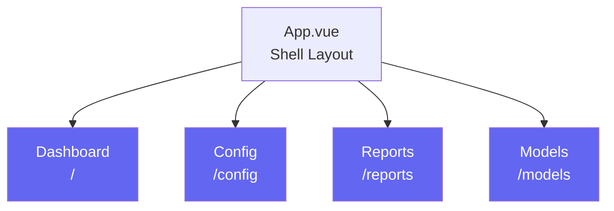
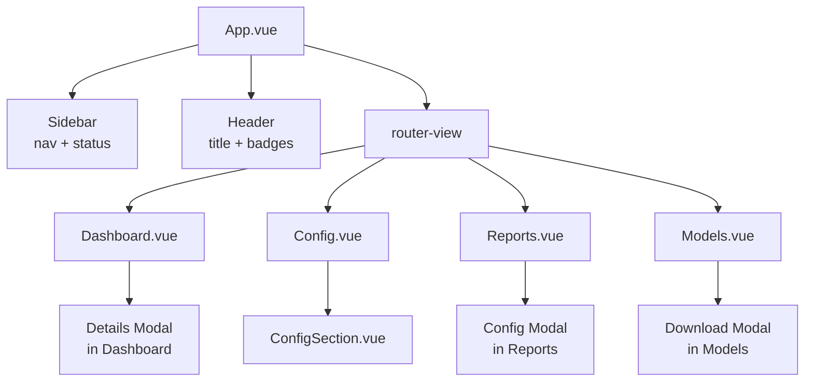
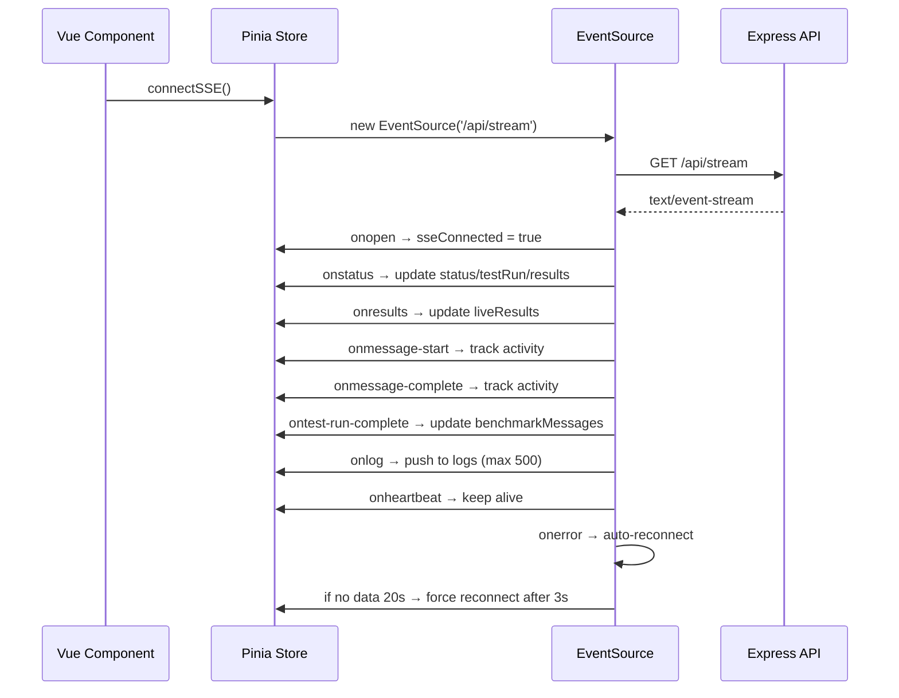
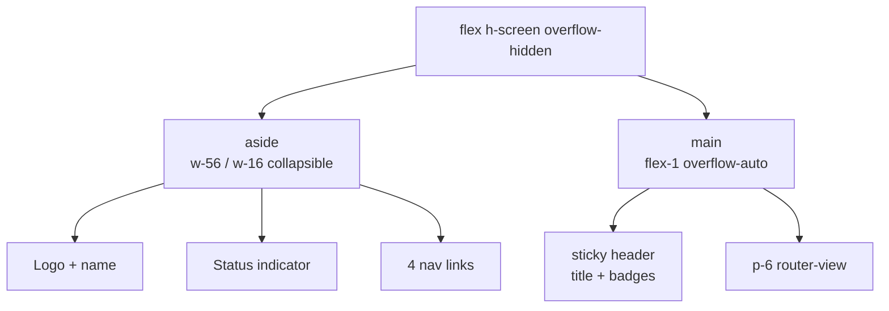

# Betty Frontend

The Betty frontend is a Vue.js 3 single-page application (SPA) with a dark-themed, Tailwind CSS-styled interface for managing benchmarks, configurations, reports, and models.

## Tech Stack

| Layer | Technology |
|-------|-----------|
| Framework | Vue.js 3 (Composition API, `<script setup>`) |
| State Management | Pinia |
| Routing | Vue Router 4 (history mode) |
| Styling | Tailwind CSS v4 (via `@tailwindcss/vite` plugin) |
| Build | Vite 6 |
| HTTP Client | Axios (REST), native `fetch` + `ReadableStream` (SSE) |
| Icons | Heroicons (inline SVG) |

## Project Structure

```
frontend/
├── src/
│   ├── App.vue                 # Shell layout with sidebar + header
│   ├── main.js                 # App entry (router + store setup)
│   ├── router/
│   │   └── index.js            # 4 routes: /, /config, /reports, /models
│   ├── stores/
│   │   └── benchmark.js        # Pinia store (all state + API actions)
│   ├── views/
│   │   ├── Dashboard.vue       # Benchmark controls, live results, logs
│   │   ├── Config.vue          # Config editor, build controls, profiles
│   │   ├── Reports.vue         # Report list, viewer, config inspector
│   │   └── Models.vue          # HuggingFace search & download
│   ├── components/
│   │   └── ConfigSection.vue   # Reusable config form section
│   └── styles/
│       └── main.css            # Tailwind theme (dark mode, custom colors)
├── dist/                       # Built output (served by Express)
├── index.html
├── vite.config.js
├── package.json
└── env.production              # VITE_API_URL (set by update-api-url.sh)
```

## Route Structure



### Route Details

| Path | Component | Title | Description |
|------|-----------|-------|-------------|
| `/` | `Dashboard.vue` | Dashboard | Live benchmark controls, status, results table, log viewer |
| `/config` | `Config.vue` | Config | Configuration editor with build options, run options, profiles |
| `/reports` | `Reports.vue` | Reports | Report list, detail viewer, per-run config inspector |
| `/models` | `Models.vue` | Models | HuggingFace model search, file picker, download manager |

## Component Hierarchy



## State Management (Pinia Store)

The single Pinia store (`stores/benchmark.js`) manages all application state:

### State

```javascript
{
  // Benchmark state
  status: 'idle',           // idle | building | testing | error | stopped
  testRun: 0,
  liveResults: [],
  processAlive: false,
  logs: [],                 // Last 500 log lines
  error: null,
  sseConnected: false,

  // Configuration
  configs: null,

  // Reports & profiles
  reports: [],
  currentReport: null,
  resultsMd: '',
  profiles: [],
  benchmarkMessages: [],

  // Build state
  buildStatus: 'idle',      // idle | building | success | error
  buildLogs: [],
  buildProgress: 0,

  // Systemd service
  serviceActive: false,

  // System memory
  systemMemory: { totalGB, usedGB, availableGB, percentUsed },

  // HuggingFace
  hfSearchResults: [],
  hfModelDetails: null,
  hfModelFiles: [],
  hfDownloads: [],
  hfError: null,
}
```

### Getters

| Getter | Type | Description |
|--------|------|-------------|
| `isRunning` | boolean | `building` or `testing` |
| `isIdle` | boolean | Status is `idle` |
| `isError` | boolean | Status is `error` |
| `isStopped` | boolean | Status is `stopped` |
| `isBuilding` | boolean | Build status is `building` |
| `buildSuccess` | boolean | Build status is `success` |
| `buildError` | boolean | Build status is `error` |
| `latestResult` | object | Last item in `liveResults` |
| `totalRuns` | number | Length of `liveResults` |
| `avgGenTokensPerSec` | number | Average generation throughput |
| `avgPromptTokensPerSec` | number | Average prompt throughput |

### Actions

The store has ~40 actions organized by domain:

**Benchmark:**
- `fetchStatus()`, `startBenchmark(env)`, `stopBenchmark()`, `killPort()`
- `connectSSE()`, `disconnectSSE()`, `clearLogs()`, `clearMessages()`

**Configuration:**
- `fetchConfigs()`, `saveConfigs(configs)`

**Reports:**
- `fetchReports()`, `fetchReport(name)`, `deleteReport(name)`, `saveReport(name)`
- `fetchResults()`, `fetchMessages()`

**Profiles:**
- `fetchProfiles()`, `saveProfile(name, configs)`, `loadProfile(name)`, `deleteProfile(name)`

**Build:**
- `buildLlamaCpp()` — SSE-based build with progress tracking
- `clearBuildLogs()`

**Service:**
- `startService()`, `stopService()`, `fetchServiceStatus()`

**System:**
- `fetchSystemStatus()`

**HuggingFace:**
- `searchHfModels(query, limit, filter)`, `fetchHfModelDetails(modelId)`
- `fetchHfModelFiles(modelId)`, `downloadHfModel(modelId, filename, onProgress)`
- `fetchHfDownloads()`, `deleteHfDownload(modelId)`

## SSE Client Integration

The SSE client is implemented in `connectSSE()` and handles:

### Connection Management



### SSE Event Handlers

| Event | Handler | Effect |
|-------|---------|--------|
| `status` | `this.status = data.status` | Update status badge, test run number |
| `results` | `this.liveResults = data.liveResults` | Update results table |
| `message-start` | Track timestamp | Activity heartbeat |
| `message-complete` | Track timestamp | Activity heartbeat |
| `test-run-complete` | `this.benchmarkMessages = data.messages` | Update message data for detail modal |
| `log` | `this.logs.push({type, text, timestamp})` | Append to log viewer (max 500) |
| `heartbeat` | Track timestamp | Connection alive |

### Build SSE Parser

The `buildLlamaCpp()` action implements a custom SSE parser using `ReadableStream`:

```javascript
// Parse SSE format from byte stream
const parts = buffer.split('\n\n')
buffer = parts.pop() || ''
for (const eventBlock of parts) {
  // Parse event: and data: lines
  if (currentEvent === 'build-log') {
    if (currentData.startsWith('PROGRESS:')) → buildProgress
    if (currentData.startsWith('STATUS:')) → buildStatus
    if (currentData.startsWith('ERROR:')) → buildLogs
  }
}
```

### Download SSE Parser

The `downloadHfModel()` action uses the same pattern for HF download progress:

```javascript
if (currentEvent === 'hf-download') {
  if (currentData.startsWith('PROGRESS:')) → onProgress(percent, bytes)
  if (currentData.startsWith('STATUS:Download complete')) → success
  if (currentData.startsWith('ERROR:')) → hfError
}
```

## Layout



## Theme

The dark theme uses Tailwind CSS v4 with custom tokens in `main.css`:

| Token | Color | Usage |
|-------|-------|-------|
| `--color-bg-primary` | `#0a0a0b` | Page background |
| `--color-bg-secondary` | `#131316` | Sidebar, cards |
| `--color-bg-tertiary` | `#1a1a1f` | Inputs, badges |
| `--color-border` | `#2a2a32` | Borders, dividers |
| `--color-text-primary` | `#f0f0f3` | Primary text |
| `--color-text-secondary` | `#a0a0b0` | Secondary text |
| `--color-text-muted` | `#6a6a7a` | Muted text |
| `--color-accent` | `#6366f1` | Primary accent (indigo) |
| `--color-success` | `#22c55e` | Success states |
| `--color-warning` | `#f59e0b` | Warning states |
| `--color-error` | `#ef4444` | Error states |
| `--color-info` | `#3b82f6` | Info states |

## API URL Configuration

The frontend uses `VITE_API_URL` environment variable (set by `scripts/update-api-url.sh`):

```bash
# Detected from network interface, written to frontend/.env.production
VITE_API_URL=http://100.105.3.99:3456
```

If not set, defaults to empty string (same-origin requests).

## See Also

- [[betty-architecture]] — System architecture
- [[betty-api-reference]] — API endpoints consumed by the frontend
- [[betty-configuration]] — Configuration system

## Tags

betty, vue.js, frontend, pinia, tailwind, sse, web-ui
