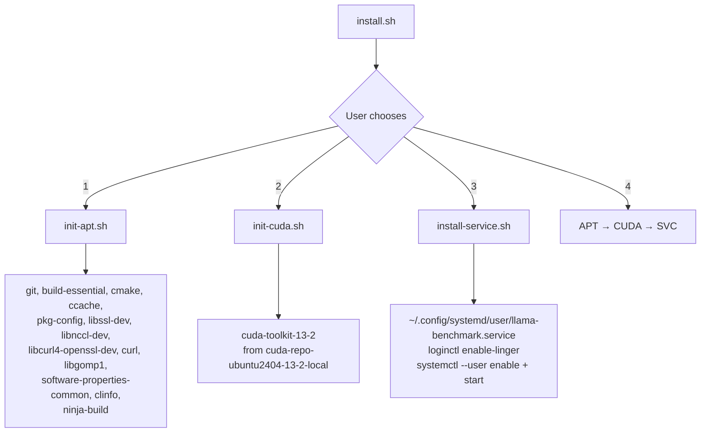

# Betty Installation

This guide covers installing Betty on Ubuntu 24.04 with CUDA support and systemd service management.

## Prerequisites

- Ubuntu 24.04 (or compatible)
- NVIDIA GPU with CUDA support
- Root/sudo access for package installation
- Node.js 18+ and npm

## Installation Script

Betty provides an interactive installer at `install.sh`:



### Step-by-Step

#### 1. Install APT Packages

```bash
bash scripts/init-apt.sh
```

Installs build tools and libraries:
- `git` — repository cloning
- `build-essential` — C/C++ compiler toolchain
- `cmake` — build configuration
- `ccache` — build caching
- `pkg-config` — library discovery
- `libssl-dev`, `libcurl4-openssl-dev` — networking libraries
- `libnccl-dev` — NVIDIA Collective Communications Library
- `ninja-build` — build system
- `clinfo` — GPU information tool
- `libgomp1` — OpenMP runtime

#### 2. Install CUDA 13.2

```bash
bash scripts/init-cuda.sh
```

Downloads and installs CUDA 13.2 from NVIDIA's official repository:
1. Adds CUDA repository pin (`cuda-ubuntu2404.pin`)
2. Installs `cuda-repo-ubuntu2404-13-2-local` package
3. Installs `cuda-toolkit-13-2`
4. Sets up NVCC at `/usr/local/cuda-13.2/bin/nvcc`

#### 3. Install Systemd Service

```bash
bash scripts/install-service.sh
```

Creates a user-level systemd service:

**Service file** (`~/.config/systemd/user/llama-benchmark.service`):
```ini
[Unit]
Description=llama-benchmark
After=network.target

[Service]
Type=simple
WorkingDirectory=/path/to/betty
ExecStart=npm run start
Restart=on-failure
RestartSec=5
Environment=HOME=$HOME

[Install]
WantedBy=default.target
```

Also enables linger for the current user (`loginctl enable-linger`) so services persist after logout.

## Interactive Installer

```bash
bash install.sh
```

Menu:
```
  1) Install APT packages (build tools, libraries)
  2) Install CUDA 13.2
  3) Install systemd user service
  4) Run all (APT → CUDA → Service)
```

## Manual Setup

### Node.js Dependencies

```bash
npm install              # Backend dependencies
cd src/backend/frontend && npm install  # Frontend dependencies
```

### Build Frontend

```bash
npm run build:frontend
```

Or:
```bash
cd src/backend/frontend && npm run build
```

### Start the Server

```bash
npm start
```

This runs:
1. `scripts/update-api-url.sh` — detects machine IP, writes to `frontend/.env.production`
2. `npm run build:frontend` — builds Vue.js app
3. `node ./src/backend/api-server.js` — starts Express API server

### Start Manually (without URL auto-detection)

```bash
# Build frontend
npm run build:frontend

# Start server (use default port 3456)
node src/backend/api-server.js
```

## Remote Access Configuration

### Network Interface

The installer detects the machine's IP address via the configured network interface (default: `eth0`). The `update-api-url.sh` script writes the detected IP to `frontend/.env.production`:

```bash
VITE_API_URL=http://100.105.3.99:3456
```

### Server Binding

The API server binds to `API_HOST` (default: `0.0.0.0`), making it accessible from all network interfaces:

```
http://<machine-ip>:3456
```

### CORS Configuration

Control CORS origins via the `CORS_ORIGIN` environment variable:

```bash
# Allow all origins (default)
CORS_ORIGIN=*

# Allow specific origins
CORS_ORIGIN=http://100.105.3.99,http://localhost:5173
```

### Firewall

If a firewall is active, allow the API port:

```bash
sudo ufw allow 3456/tcp
```

## Service Management

### From the UI

The Config view provides buttons to:
- **Start/Stop** `llama.service` (the inference service)
- **Install** a systemd service from any benchmark report's launch command

### From the Command Line

```bash
# Status
systemctl --user status llama-benchmark.service

# Start/Stop/Restart
systemctl --user start llama-benchmark.service
systemctl --user stop llama-benchmark.service
systemctl --user restart llama-benchmark.service

# Logs
journalctl --user -u llama-benchmark.service -f

# Enable/Disable
systemctl --user enable llama-benchmark.service
systemctl --user disable llama-benchmark.service
```

### llama.service (Inference Service)

Betty can install a separate `llama.service` from any benchmark report. This runs llama-server with the exact parameters from a specific test run:

```bash
# Install from report
POST /api/service/install { reportName, testRunId }

# Manage
systemctl --user status llama.service
systemctl --user start llama.service
systemctl --user stop llama.service
```

The service writes:
- Service file: `~/.config/systemd/user/llama.service`
- Environment file: `~/.config/systemd/user/llama-benchmark.env`

## Troubleshooting

### Port Already in Use

```bash
# Check what's on the port
lsof -i :3456

# Kill processes on the port
POST /api/kill-port

# Or manually
kill -9 $(lsof -ti :3456)
```

### CUDA Not Found

```bash
# Verify CUDA installation
nvcc --version

# Check nvcc path
ls -la /usr/local/cuda-*/bin/nvcc

# Update cuda_configs.cudacxx in configs.json if path differs
```

### Build Fails

```bash
# Check cmake
cmake --version

# Check CUDA toolkit
ls /usr/local/cuda-*/include/cuda.h

# Clear build cache
rm -rf src/backend/llama.cpp/build
```

### Frontend Won't Load

```bash
# Rebuild frontend with updated API URL
npm start

# Or manually
bash scripts/update-api-url.sh
npm run build:frontend
```

### Service Won't Start After Logout

```bash
# Enable linger for your user
loginctl enable-linger $USER

# Verify
loginctl show-user $USER | grep Linger
```

## See Also

- [[betty-project]] — Project overview
- [[betty-configuration]] — Configuration system
- [[betty-qa]] — Usage examples

## Tags

betty, installation, ubuntu, cuda, systemd, apt, service
