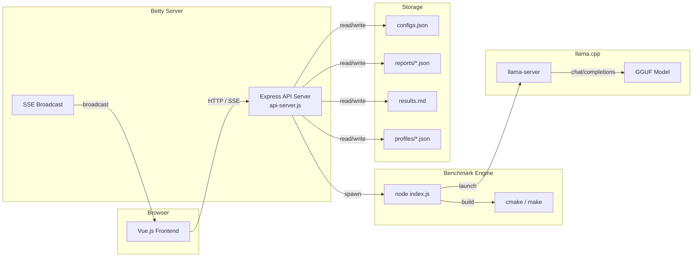

# Betty Project

**Betty** is a web-based benchmarking UI for [llama.cpp](llama.cpp). It provides a complete workflow for building llama.cpp, running GPU-accelerated performance benchmarks, managing models via HuggingFace, and persisting results as reproducible reports.

## What It Is

Betty turns llama.cpp benchmarking from a series of manual shell commands into a structured, visual workflow:

1. **Configure** build flags, CUDA options, and test parameters via a web UI
2. **Build** llama.cpp with cmake (or skip if already built)
3. **Run benchmarks** that exercise the model with sequential chat messages, measuring tokens/sec, memory, and timing
4. **Save reports** with full per-test-run configuration, commands, and results
5. **Install as a systemd service** from any report for long-running inference

## Architecture at a Glance



## Tech Stack

| Layer | Technology |
|-------|-----------|
| Frontend | Vue.js 3, Pinia, Vue Router, Tailwind CSS v4, Vite |
| Backend | Node.js, Express.js, CORS, Axios |
| Benchmark Engine | Node.js (child process), llama.cpp (C++/CUDA) |
| Communication | SSE (Server-Sent Events), REST API |
| Build | cmake, make, CUDA toolkit |
| Service | systemd (user services) |
| Configuration | JSON (configs.json), .env |

## Directory Structure

```
betty/
├── install.sh                          # Interactive installer (APT → CUDA → systemd)
├── scripts/
│   ├── init-apt.sh                     # APT package installation
│   ├── init-cuda.sh                    # CUDA 13.2 installation
│   └── install-service.sh              # Systemd user service setup
├── package.json                        # Node.js dependencies
├── src/
│   └── benchmark/
│       ├── api-server.js               # Express API server (1997 lines)
│       ├── index.js                    # Benchmark runner engine (1517 lines)
│       ├── configs.json                # Configuration file (auto-synced with defaults)
│       ├── results.md                  # Generated results (markdown tables)
│       ├── reports/                    # Saved benchmark reports (JSON)
│       ├── profiles/                   # Saved config profiles (JSON)
│       ├── hf_downloads/               # Downloaded GGUF models
│       ├── llama_cache/                # llama.cpp KV cache
│       └── frontend/                   # Vue.js frontend
│           ├── src/
│           │   ├── App.vue             # Shell with sidebar nav
│           │   ├── router/index.js     # 4 routes (Dashboard, Config, Reports, Models)
│           │   ├── stores/benchmark.js # Pinia store (SSE + API actions)
│           │   ├── views/
│           │   │   ├── Dashboard.vue   # Live benchmark controls & logs
│           │   │   ├── Config.vue      # Build/run config editor
│           │   │   ├── Reports.vue     # Report viewer & config inspector
│           │   │   └── Models.vue      # HuggingFace model search & download
│           │   ├── components/
│           │   │   └── ConfigSection.vue  # Reusable config form section
│           │   └── styles/
│           │       └── main.css        # Tailwind CSS theme (dark mode)
│           ├── dist/                   # Built frontend (served by Express)
│           ├── vite.config.js
│           └── package.json
└── library/                            # Documentation (this file)
```

## Quick Start

```bash
# Install dependencies
npm install

# Build frontend
npm run build:frontend

# Start the API server (serves frontend + API on port 3456)
npm start

# Open in browser
open http://localhost:3456
```

## Key Concepts

- **Test Run**: One complete benchmark iteration (4 sequential messages with accumulating context). Multiple test runs vary parameters like context length, batch size, and cache RAM.
- **Config Profile**: A saved snapshot of `configs.json` that can be loaded, shared, and compared.
- **Report**: A saved benchmark run with full results, per-test-run configurations, and reproducible build/launch commands.
- **SSE Stream**: Real-time connection from API server to frontend for live status, logs, results, and message data.

## See Also

- [[betty-architecture]] — System architecture deep-dive
- [[betty-api-reference]] — Complete API endpoint documentation
- [[betty-benchmark-engine]] — How the benchmark runner works
- [[betty-frontend]] — Frontend architecture and components
- [[betty-configuration]] — Configuration system details
- [[betty-installation]] — Installation and setup guide
- [[betty-qa]] — Usage examples and troubleshooting

## Tags

betty, benchmark, vue.js, express, sse, llama.cpp, configuration, installation, huggingface, web-ui
